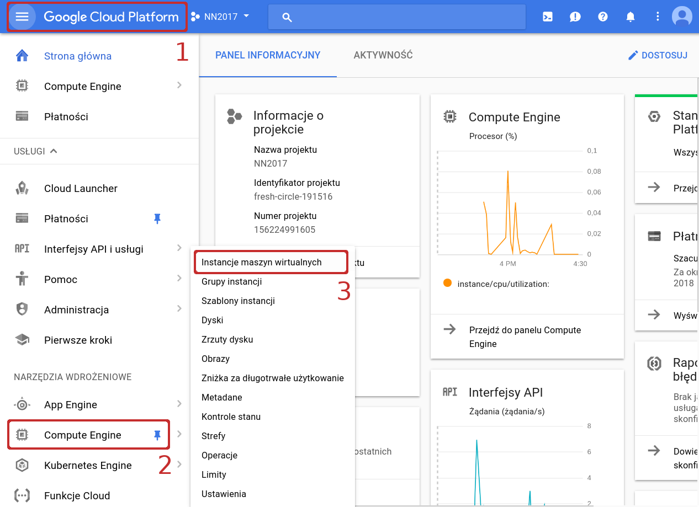
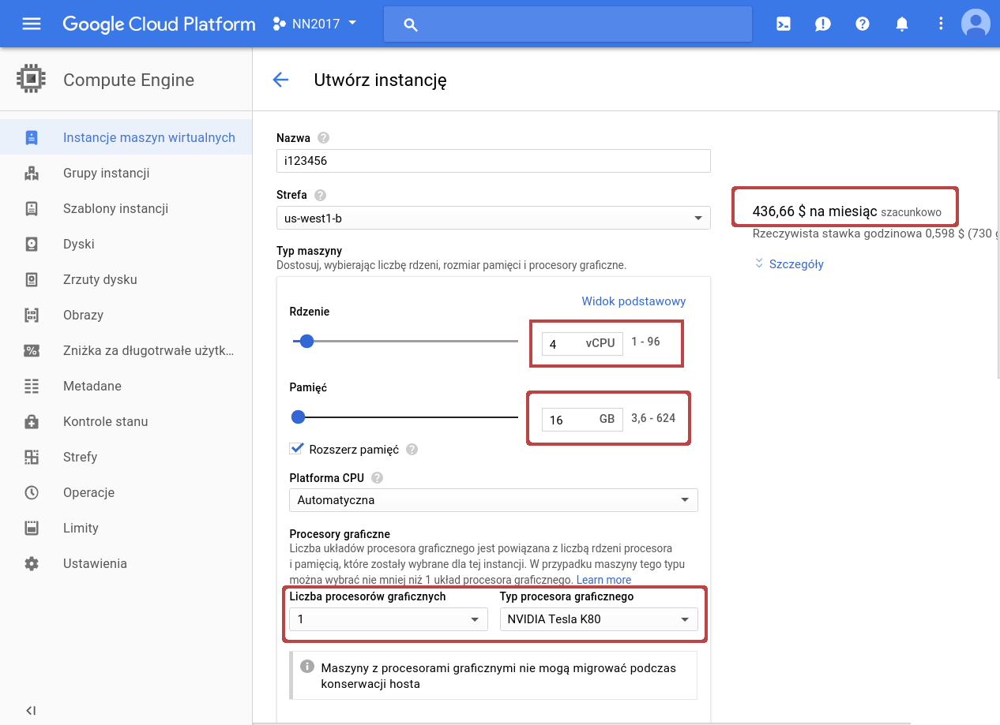
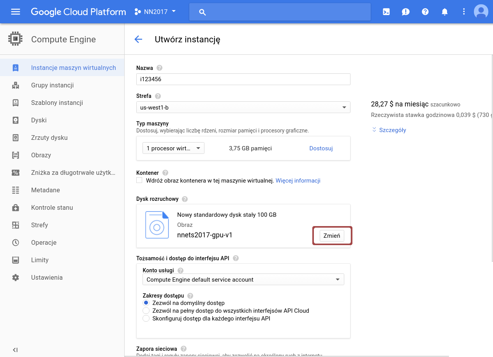
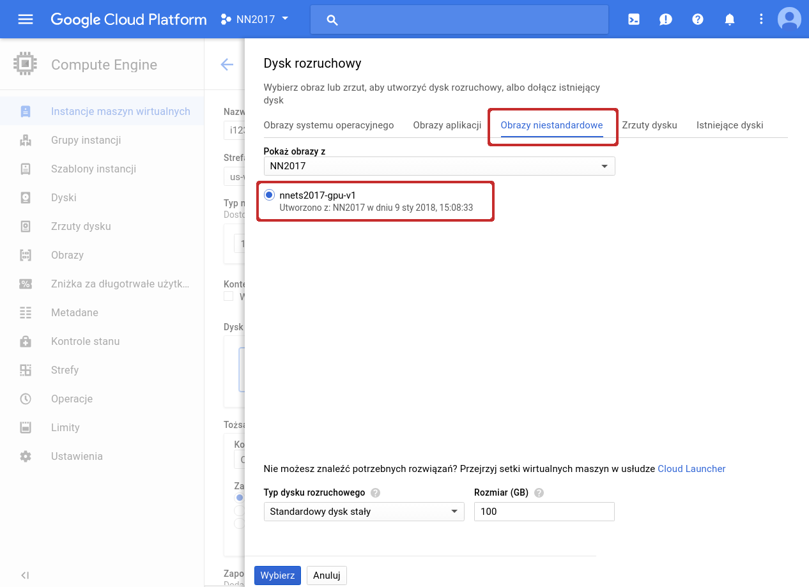
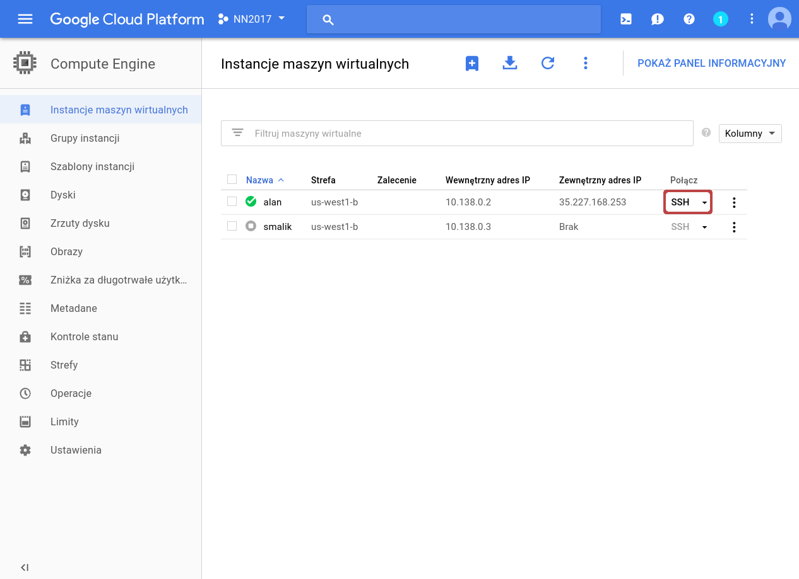
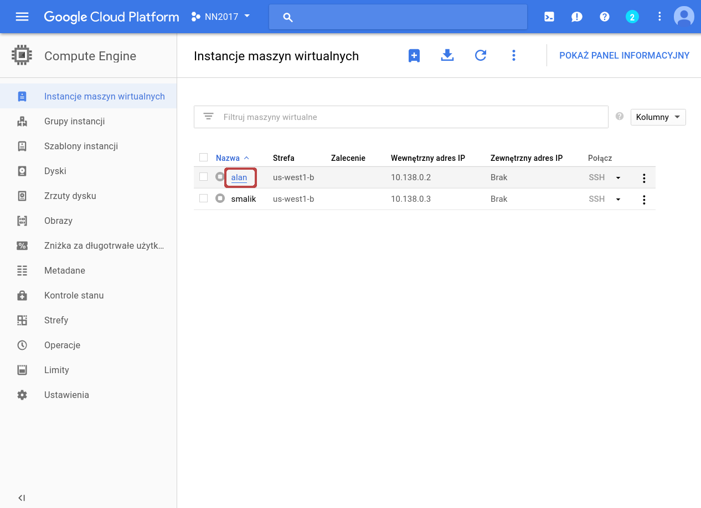
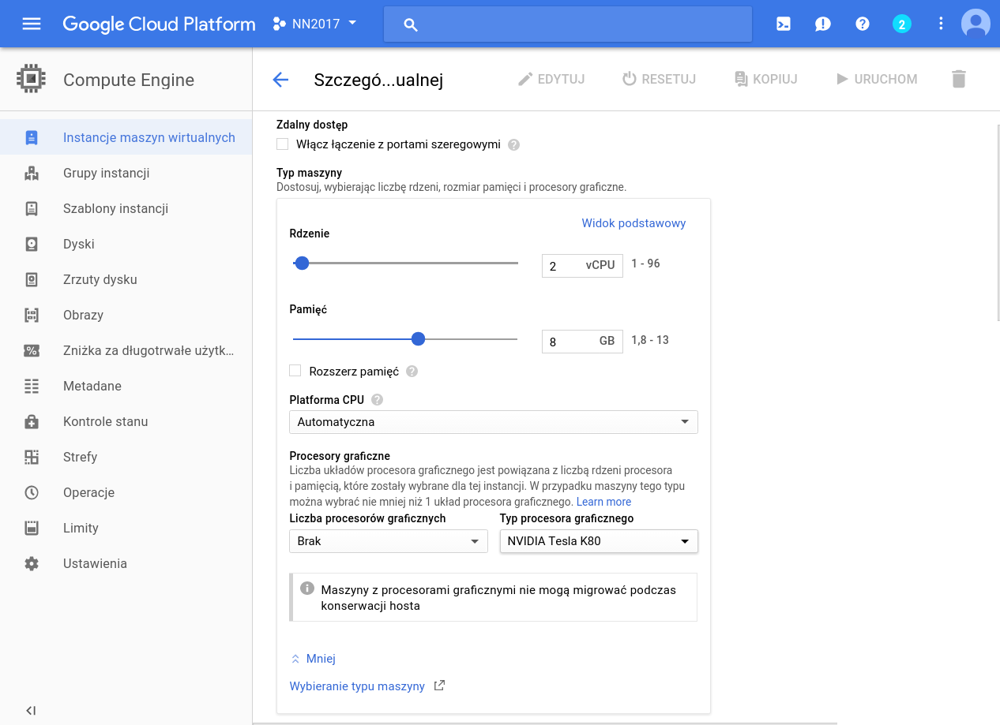
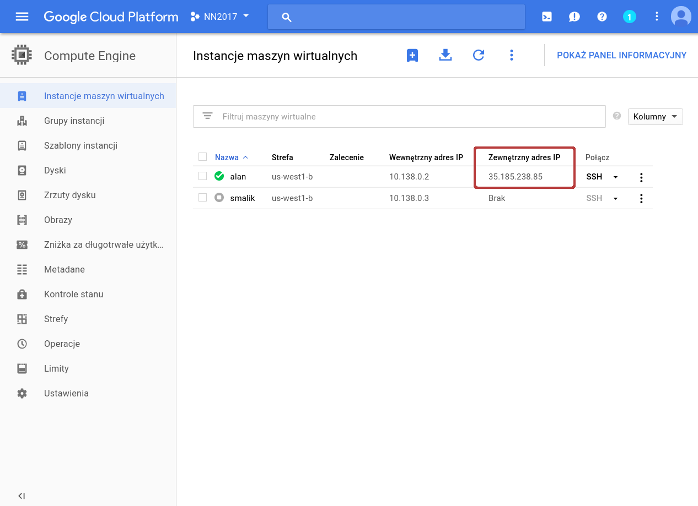

# Using the Google Cloud Platform Compute Engine
Students of the Neural Networks and Deep Learning course at Univerity of Wroclaw
can use the Compute Engine for free (curiosity of Google).

Below we'll shortly outline how to have it up and running in no time.

## 0. Prerequisites

You (or your team) will work on a individual virtual machine(s).
You can create a preconfigured machine with the same software stack
(`/pio/os`) that you are using in the labs!

The instances are billed by hour depending on their hardware configuration.
Please keep in mind, that we have a fixed budget donated by Google.
We will ask you to respect it and:
* turn off the instances when they are not in use,
* if the instances need to be on, but no computations are taking place on the GPUs,
restart the instances with GPUs unmounted (instances without GPUs have much lower running cost),
* do not access or modify virtual machines of your colleagues.

**NOTE: Wasteful or irresponsible behavior will be penalized through subtraction of lab points
(we'll call it [``karny kaktus``](http://pics.tinypic.pl/i/00224/145fkpsmoasr.png "Karny Kaktus")).**

## 1. Request the access
Request the account from your lab instructor (via e-mail).
Once you get a confirmation, you can proceed to the next step.

Please note that to use GCE for the class you *don't need* to sign up for the free trial
and you *don't need* to give your credit card details. 

## 2. Log in
Visit [https://cloud.google.com/compute/](https://cloud.google.com/compute/) and log in.

Go to the management console and list the instances.

## 3. Create a new virtual machine

Start by clicking the 'Add' button.

Select a descriptive name, which will make it clear for us who
is the owner or what the project is about. Then make sure that
the Zone is us-west1-b (it should be the default). Then set up the hardware.

Select the configuration (sample one is shown below).
Note that the monthly cost is show on the right. We recommend the following configuration:
* 4 vCPUs (don't use the cheapest shared CPUs)
* 16GB of RAM
* 1 Tesla K80 GPUs. Please note that the GPUs are expensive and that they can be added and removed at will from an existing instance so you can debug your projcet on the CPU and only when it works attach the GPU. Please talk with the instructors if you need more than 1 GPU.

Select the hard disk image, which features our code stack (specifically `/pio/os/cuda`, `/pio/os/anaconda`). To do it select custom images->NN2017->nnets2017-gpu. Adjust the hard drive size to your needs (the default of 100GB has about 50GB of free space, you can increase it later too).

## 4. Start the machine and log in

You can start/stop the machine on demand. **Please shut down the machine when you don't use it, we are billed for the time it is on, regardless of whether you compute anything on it!**

A basic `SSH` console can be started in a pop-up
window. You need to allow pop-ups from console.cloud.google.com!

## 5. Manage the machine

When the machine is off, you can open machine management interface
by clicking on the name of the machine. This allows changing the HDD size, changing RAM and vCPUs as well as adding and removing the GPUs.

You can edit settings and adjust the hardware.

If you need to run the instance without using GPUs for longer perids of time
(e.g., for coding or uploading the data) we ask you to turn off the instance,
edit the hardware and unmount the GPU. This way you will save credits.

To work comfortably:
* add your public ssh keys  to `/home/YOUR_USERNAME/.ssh/authorized_keys` and connect remotely, using the machine's external IP address, which changes after every reboot,
* keep your code in an external repository,
* save snapshots during training and design your code to resume the training in case of failures.

Please note that GPU instances can be powered off for maintenance, possibly without warning. This is unlikely, but please save your code and your results early to prevent data loss.

## 6. Getting your data in and out

You can use `rsync` or `scp` to copy the data:
* setup `ssh` keys,
* to upload the data to the cloud with `rsync` use a command like:
  `rsync -avz -e ssh <PATH_ON_LOCAL_HOST> <IP>:/<PATH_ON_REMOTE_HOST>`
* to upload the data to the cloud with `rsync` use a command like:
  `rsync -avz -e ssh <IP>:/<PATH_ON_REMOTE_HOST> <PATH_ON_LOCAL_HOST>`
